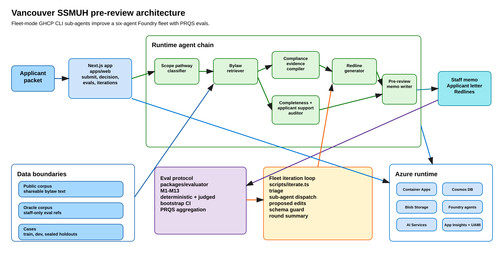
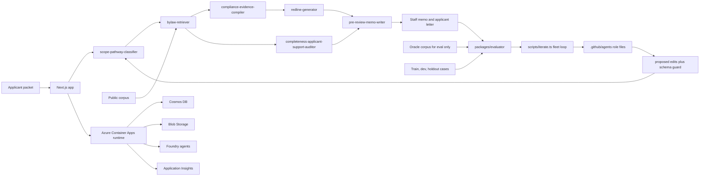

# Architecture

Build a Vancouver SSMUH permit pre-review copilot for staff planners and the developers reading the blog. The headline pattern is fleet-mode GitHub Copilot CLI sub-agents iterating on a six-agent Azure AI Foundry fleet, with PRQS evals deciding whether each round moves forward.

## System diagram



Open the editable source at [architecture.excalidraw](./architecture.excalidraw).



## Components

### Runtime agents

Run six repo-authored agents from `agents/<agent-id>/`. The runtime chain starts with `agents/scope-pathway-classifier`, then `agents/bylaw-retriever`, then `agents/compliance-evidence-compiler` and `agents/completeness-applicant-support-auditor`, then `agents/redline-generator`, and ends with `agents/pre-review-memo-writer`. Inputs are a synthetic permit packet plus upstream JSON outputs, and outputs are pathway labels, bylaw citations, evidence maps, completeness flags, redlines, staff memos, and applicant letters.

### Data corpus

Store shareable bylaw excerpts under `datasets/policy-corpus/public/`, and index only that pool into the retriever vector store. Keep staff-only references under `datasets/policy-corpus/oracle/`, where the eval runner can read decision matrices, required evidence maps, simplification notes, and reference outputs. Store cases under `datasets/cases/*.{train,dev,holdout,gold-holdout}.jsonl[.age]`, with train visible to allowed few-shot work, dev reserved for aggregate scoring, and holdout plus gold holdout sealed with age.

### Eval protocol

Score outputs in `packages/evaluator` with the PRQS protocol from spec 001. Combine M1 through M13 across deterministic checks, taxonomy matches, and judged metrics, then publish mean PRQS with bootstrap confidence intervals. Feed outputs from the runtime JSONL into `train.eval.jsonl`, `train.report.md`, and round summaries.

### Fleet-mode iteration loop

Drive each round with `scripts/iterate.ts` and the GHCP CLI role files in `.github/agents/*.md`. Run triage, dispatch one prompt iterator and one few-shot iterator per runtime agent, collect `prompt-edits.json` and `fewshot-edits.json`, and apply edits only through the schema guard. Emit receipts under `eval-reports/round-NNN-fleet/` so the operator can review diffs, the baseline rerun, and the round recommendation.

### Next.js app

Serve the developer-facing and planner-facing UI from `apps/web/` with Next.js, shadcn UI, Tailwind, and shared SSMUH types. Expose four durable user surfaces: `/decisions/submit` for packet intake, `/decisions/[id]` for staff memo plus applicant letter review, `/evals/dashboard` for PRQS and M1-M13 movement, and `/iterations` for fleet round status. Inputs are packets, case IDs, reports, and round artifacts, and outputs are review screens, copied memos, applicant letters, and operator dashboards.

### Azure runtime

Author Azure resources from `infra/`, with the target shape recorded in `infra/README.md` and the foundation spec. Run the web app on Azure Container Apps, store cases and run metadata in Cosmos DB, store corpus, uploads, and artifacts in Blob Storage, run agents in Azure AI Foundry, use Azure AI Services for model deployments, send telemetry to Application Insights, and grant access through a user-assigned managed identity. The web app consumes Bicep outputs as environment variables and secrets.

### gh-models judge runtime

Use the gh-models runtime from spec 004 for laptop-reproducible baselines. The deterministic path runs without judge calls, and the judged path adds M12 and M13 through `gh models eval` with frozen prompts and JSON parsing. This path lets the tutorial show the same pipeline before the Azure Foundry promotion is ready.

## Data flow: applicant submits a packet

1. Submit a synthetic SSMUH packet through the Next.js app. The packet carries zoning, proposed units, numeric envelope fields, documents, and applicant context.
2. Call `agents/scope-pathway-classifier` to choose the review pathway and escalation state.
3. Call `agents/bylaw-retriever` to rank public bylaw section IDs from `datasets/policy-corpus/public/`.
4. Call `agents/compliance-evidence-compiler` to map required evidence against provided evidence and compute numeric gaps.
5. Call `agents/completeness-applicant-support-auditor` to decide Stage 1 completeness, missing items, applicant-support flags, and equity notes.
6. Call `agents/redline-generator` to propose compliant field changes for expected gaps.
7. Call `agents/pre-review-memo-writer` to combine upstream outputs into a staff memo and an applicant letter.
8. Persist or display the package in the app, then feed the runtime payload to PRQS evals when the case belongs to a scored split.

## Data flow: operator iterates a round

1. Run the baseline or prior round eval through `pnpm baseline` or `pnpm iterate` so runtime and eval JSONL files land in `eval-reports/round-NNN-fleet/`.
2. Triage misses with `error-triager`, grouped by agent and PRQS category.
3. Dispatch scoped GHCP CLI sub-agents from `.github/agents/*.md` with the exact context bundle from `scripts/iterate.ts`.
4. Collect per-agent proposed edits under `eval-reports/round-NNN-fleet/per-agent/<agent-id>/`.
5. Apply edits with the orchestrator guard, which validates prompt and few-shot schemas before touching `agents/<agent-id>/`.
6. Run the baseline again on the train split through the gh-models runtime.
7. Review `round-summary.md`, including PRQS delta, CI95 range, M1-M13 movement, per-agent rationale, and regression risk.
8. Decide to accept, revert, or escalate. Accept only when the round moves PRQS without a blocked artifact audit.

## Trust + privacy boundaries

Keep sub-agents away from sealed cases, `datasets/cases/*.dev.jsonl`, every `*.age` file, and `datasets/policy-corpus/oracle/**`. Follow the env-scrub baseline from [spec 000](../specs/000-foundation/SPEC.md) and [spec 005](../specs/005-fleet-iteration/SPEC.md): `PATH`, `HOME`, `LANG`, `LC_*`, and `SRS_*`. Spec 005 also notes `GH_TOKEN` and `GITHUB_TOKEN` for model access, while holdout keys and Azure secrets stay out of sub-agent env.

Use the role-file convention `forbidden_tools: [git, gh]` to block branch, commit, push, and PR operations inside sub-agents. The round-001 playbook records why this matters. Sub-agents write only their declared output contract, and scratch files stay under `.srs-iterate-tmp/`.

## Azure runtime

Deploy the production shape through `infra/`. Use Azure Container Apps for the Next.js host, Cosmos DB for cases, runs, and eval reports, Blob Storage for corpus files, uploads, and sub-agent artifacts, Azure AI Foundry for the managed agent fleet, Azure AI Services for model deployments, Application Insights for traces and metrics, and a user-assigned managed identity for secretless access.

Bridge Bicep outputs into the web app through the Container Apps environment. Use this env-var contract: `AZURE_CLIENT_ID`, `AZURE_COSMOS_ENDPOINT`, `AZURE_COSMOS_DATABASE`, `AZURE_STORAGE_ACCOUNT`, `AZURE_STORAGE_CONTAINER`, `AZURE_FOUNDRY_ENDPOINT`, `AZURE_FOUNDRY_PROJECT`, `AZURE_AI_SERVICES_ENDPOINT`, `APPLICATIONINSIGHTS_CONNECTION_STRING`, and `NEXT_PUBLIC_SRS_ENVIRONMENT`. Keep sensitive values in Container Apps secrets, and expose only non-secret names to the browser.

## Repository layout

```text
.
├── apps/                 Next.js planner and operator UI.
├── packages/             Workspace packages for Foundry runtime, evaluator, and shared schemas.
├── agents/               Source of truth for the six SSMUH runtime agents.
├── datasets/             Public corpus, oracle corpus, synthetic cases, splits, and few-shots.
├── scripts/              Data generation, seeding, eval, baseline, sync, ablation, and iteration CLIs.
├── infra/                Bicep and azd deployment surface for Azure runtime resources.
├── specs/                Versioned contracts for layout, evals, data, Foundry sync, runtime, and fleet iteration.
├── eval-reports/         Round outputs, PRQS reports, triage, proposed edits, diffs, and summaries.
├── .github/agents/       GHCP CLI sub-agent role files and output contracts.
└── docs/                 Operator guides, methodology, architecture, and blog support docs.
```

## References

- [Spec 000: Foundation](../specs/000-foundation/SPEC.md)
- [Spec 001: Eval protocol](../specs/001-eval-protocol/SPEC.md)
- [Spec 002: Synthetic data](../specs/002-synthetic-data/SPEC.md)
- [Spec 003: Foundry agent sync](../specs/003-foundry-agent-sync/SPEC.md)
- [Spec 004: gh-models runtime](../specs/004-ghmodels-runtime/SPEC.md)
- [Spec 005: Fleet-mode iteration loop](../specs/005-fleet-iteration/SPEC.md)
- [Fleet-mode playbook](./fleet-mode-playbook.md)
- [Round 001 fleet summary](../eval-reports/round-001-fleet/round-summary.md)
- [Infra README](../infra/README.md)
- [Web app README](../apps/web/README.md)
